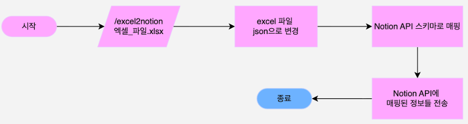
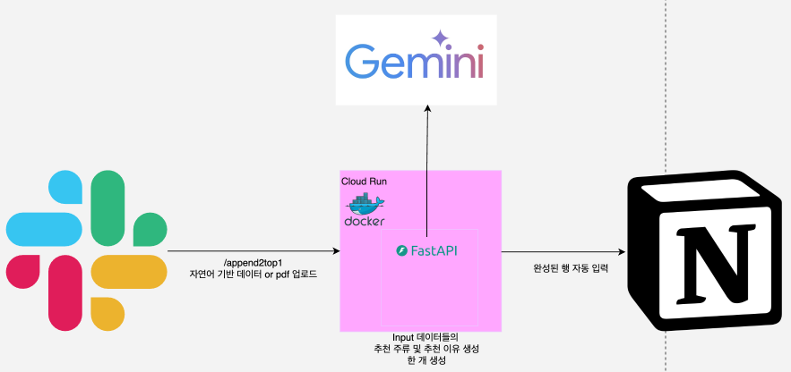
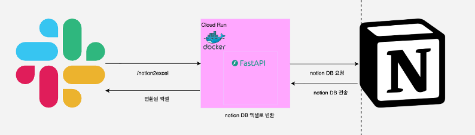
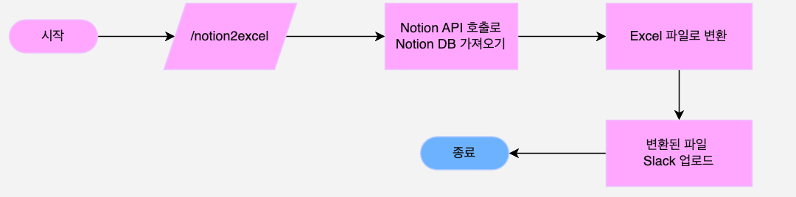

# ExcelBot - AI 기반 주류 추천 자동화 시스템

프로젝트 발표자: 최명재

---

## 프로젝트 개요

### 목표

레스토랑별 특성에 맞는 주류를 **AI 기반으로 자동 추천**하여 B2B 담당자의 업무 효율성을 극대화합니다.

### 핵심가치

- **자동화**: 수작업 추천 프로세스 자동화
- **정확도**: AI 기반 유사도 분석으로 높은 추천 정확도 달성
- **통합성**: 기존 업무 흐름(슬랙, 노션)에 자연스럽게 통합

---

## 정량적 목표

### 추천 주류 정확도

- **Top1**: 70% 이상

  - 수동 수정 필요: 30% (실용적인 수준)
  - N개 데이터 120분 → 0.3N 36분
  - **약 3배 효율 증가**

- **Top3**: 90% 이상
  - Top1의 70% 신뢰도를 Top3로 향상

### 추천 이유 유사도

- 기존 추천 이유와 생성된 추천 이유 유사도: **0.7 이상**
- 코사인 45도 값(0.707)을 유사한 값으로 판단 (논문/연구 결과)

---

## Train/Test 비율 선정: 8:2

### 수학적 근거

```
훈련 세트: p·N개 → 표준편차 = 1/√(p·N)
테스트 세트: (1−p)·N개 → 표준편차 = 1/√((1−p)·N)

전체 오차: 1/(p(1-p)·N)
```

- 전체 오차 최소화를 위해 p(1-p) 최대가 되도록 p 선택
- 조건: 2[훈련 표준편차] ≤ [테스트 표준편차]
- **결과: p = 0.8 (8:2 비율)**

출처: "Why 70/30 or 80/20 Relation Between Training and Testing Sets" (Gholamy et al., 2018)

---

## 유사도 측정 방식 비교

|     방식      |               장점               |                단점                 |    결과     |
| :-----------: | :------------------------------: | :---------------------------------: | :---------: |
|  **TF-IDF**   |       구현 간단, 빠른 개발       | 의미 이해 부족 ("소고기"≠"쇠고기")  |   ❌ 제외   |
| **규칙 기반** |          초기 높은 성능          | 1000개 음식점마다 수백 개 규칙 필요 |   ❌ 제외   |
| **결정 트리** |          텍스트 불필요           |         시그니처메뉴 미활용         |   ❌ 제외   |
|  **임베딩**   | 입력 데이터 완전 활용, 확장 용이 |         벡터 연산 이해 필요         | ✅ **선택** |

---

## 열 가중치 계산을 통한 추천 주류 생성

### Baseline 선정

- **음식 종류**
- **평균 가격**
- **시그니처메뉴**

### 기여도 측정 방식

```
음식 종류 기여도(A) = Baseline - [평균 가격 + 시그니처메뉴] 정확도
평균 가격 기여도(B) = Baseline - [음식 종류 + 시그니처메뉴] 정확도
시그니처메뉴 기여도(C) = Baseline - [평균 가격 + 음식 종류] 정확도
식당명 기여도(D) = 식당명 포함 후 정확도 - Baseline
지역 기여도(E) = 지역 포함 후 정확도 - Baseline
평점 기여도(F) = 평점 포함 후 정확도 - Baseline
```

### 가중치 계산

```
각 기여도의 가중치 = 각 기여도 / (A+B+C+D+E+F)
```

임베딩 전에 가중치만큼 텍스트를 반복 처리합니다.

---

## 유사도에 따른 추천 이유 생성

프롬프트를 활용한 자동 가중치 조정:

- **필수 규칙**: 기존 이유의 철학과 뉘앙스 유지
- **가중치 조정**:
  - 기존 추천 근거 비중: 유사도%
  - 새로운 내용 비중: (100 - 유사도)%

---

## LLM 모델 선정

|      항목       |  Claude   |    GPT    | Gemini-Flash |
| :-------------: | :-------: | :-------: | :----------: |
|    주요 강점    | 코드 생성 |  다목적   | 텍스트 생성  |
| 프로젝트 적합도 | 오버 스펙 | 오버 스펙 |   **적절**   |
|      비용       |   $3-8    |  $14.50   |     $0-1     |
|      속도       |   느림    |   중간    |     빠름     |

**선택**: Gemini-Flash (자연어 처리 및 텍스트 생성에 최적)

---

## 임베딩 모델

**선택**: multilingual-e5-small-ko-v2

- 경량 모델
- 다국어 중 한국어 특화
- 지표: NDCG (검색 결과 및 추천 시스템의 랭킹 성능 측정)

---

## 유사도 계산 메서드

|   메서드    |  고려 대상  |    범위    |          사용 곳           |
| :---------: | :---------: | :--------: | :------------------------: |
| **코사인**  |   방향만    |   -1 ~ 1   |    임베딩, 추천 시스템     |
| Dot Product | 방향 + 크기 |   무한대   | 신경망 내부, 대규모 실시간 |
|    거리     |    거리     | 0 ~ 무한대 |      GPS, 클러스터링       |

**선택**: 코사인 유사도 (임베딩 모델이 코사인 유사도로 학습됨)

---

## Train/Test 프로세스 플로우

1. **모델 로드**
2. **Excel 파일 읽기**
3. **Train/Test 분할** (8:2 비율)
4. **텍스트 전처리 및 가중치 적용**
5. **Train 임베딩 생성**
6. **Test 임베딩 생성**
7. **코사인 유사도 계산**
8. **정확도 계산**
   - 추천 주류 정확도
   - 추천 이유 유사도 평균

---

## 배포 방식 결정

|      방식       |               장점                |           단점            |    결과     |
| :-------------: | :-------------------------------: | :-----------------------: | :---------: |
|     **웹**      |       유지보수/확장성 우수        |    기존 시스템과 분리     |   ❌ 제외   |
| **데스크톱 앱** |       유지보수/확장성 우수        |    기존 시스템과 분리     |   ❌ 제외   |
|  **엑셀 VBA**   |         엑셀 내 직접 실행         | 확장성 부족, MacOS 미지원 |   ❌ 제외   |
|   **슬랙 봇**   | 기존 워크플로우 통합, 비용 효율적 |             —             | ✅ **선택** |

---

## Slack 봇 데이터 저장: Notion DB vs Excel

|        항목        |           Notion DB            |         Excel 파일         |
| :----------------: | :----------------------------: | :------------------------: |
|   요청 처리 방식   | **병렬 처리** (동시 처리 가능) | **직렬 처리** (순차 진행)  |
| 다중 요청 시나리오 |   A, B 동시에 추천 요청 가능   |   A 완료 → B 진행 (순차)   |
|      팀 협업       |   다양한 추천 동시 처리 가능   | 한 번에 하나의 추천만 처리 |
|   비즈니스 영향    |      ✅ 팀 생산성 최대화       |    ❌ 병목 현상, 비효율    |

**선택**: Notion DB (병렬 처리로 팀 협업 효율성 극대화)

---

## 클라우드 플랫폼: Cloud Run vs Lambda

|    항목     |                 Cloud Run                 |          Lambda           |
| :---------: | :---------------------------------------: | :-----------------------: |
|  코드 패징  |           표준 Docker 컨테이너            | 코드 + Zip + 레이어 관리  |
|  요청 처리  |         1개 컨테이너가 80개 요청          | 80개 요청 = 80개 인스턴스 |
|  요청 가격  |              $0.40/백만 요청              |      $0.20/백만 요청      |
| 컴퓨팅 가격 |           $0.000002500/vCPU-초            |    $0.0000166667/GB-초    |
|  프리 티어  | 180만 vCPU-초 + 360만 GiB-초 + 200만 요청 |  100만 요청 + 40만 GB-초  |
| 배포 복잡도 |                 **간편**                  |           복잡            |

**선택**: Cloud Run (간편한 배포, 제한된 시간 내 개발)

---

## 개발 언어: Python

선택 이유:

- 높은 라이브러리 완성도
- 빠른 개발 속도
- 우수한 코드 가독성
- 의존성 관리 용이성

---

## 웹 프레임워크 비교

|        항목         |        FastAPI         |    Flask    |      Django      |
| :-----------------: | :--------------------: | :---------: | :--------------: |
|      처리 방식      |     비동기 (ASGI)      | 동기 (WSGI) |   동기 (WSGI)    |
|        속도         |     **매우 빠름**      |    보통     |     느린 편      |
| 파일 업로드 (Excel) |     **매우 쉬움**      |    쉬움     |       쉬움       |
|   Slack Bot 연동    | **최적** (비동기 지원) |    가능     |       가능       |
|   Notion API 연동   |     **매우 편함**      |    가능     |       가능       |
|  임베딩/FAISS 궁합  |        **최적**        |    보통     |       보통       |
|       확장성        |     **매우 높음**      |    중간     | 매우 높음 (과함) |

**선택**: FastAPI (비동기 처리로 다중 요청 최적 처리)

---

## 사용 시나리오

### 시나리오 1: 초기 파일 업로드

1. `/excel2notion` 슬래시 커맨드 + Excel 파일 입력
2. Excel → JSON 변환
3. Notion API 스키마로 매핑
4. Notion API에 데이터 전송
   
   

### 시나리오 2: 데이터 추가 및 Top1 추천

1. `/append2top1` 슬래시 커맨드 + 자연어/PDF 입력
2. 입력값 분석 (자연어/PDF 판별)
3. Gemini로 정해진 클래스로 변환
4. 열 가중치 적용
5. 임베딩 생성
6. Notion DB 임베딩 인덱싱
7. 유사도 계산 및 Top1 선택
8. 추천 이유 생성 (Gemini)
9. 결과를 Notion에 저장 및 Slack 알림
   
   

### 시나리오 3: 데이터 추가 및 Top3 추천

시나리오 2와 동일하나, 추천 개수만 Top3으로 변경

### 시나리오 4: Excel로 반환

1. `/notion2excel` 슬래시 커맨드 입력
2. Notion API로 DB 조회
3. Excel 파일로 변환
4. Slack에 파일 업로드
   
   

---

## 개발 일정

|             작업              | 1일 | 2일 | 3일 | 4일 | 5일 | 6일 | 7일 |
| :---------------------------: | :-: | :-: | :-: | :-: | :-: | :-: | :-: |
| 열 가중치 계산 및 정확도 개선 | ✓✓✓ |     |     |     |     |     |     |
| 로컬 환경에서 개발 및 테스트  | ✓✓  |     |     |     |     |     |     |
|             배포              |  ✓  |     |     |     |     |     |     |

---

## 기술 스택 요약

|       분류        |            기술             |
| :---------------: | :-------------------------: |
|  **프레임워크**   |           FastAPI           |
|     **언어**      |           Python            |
|    **임베딩**     | multilingual-e5-small-ko-v2 |
|      **LLM**      |     Google Gemini Flash     |
|  **유사도 계산**  |      Cosine Similarity      |
|   **클라우드**    |      Google Cloud Run       |
|  **데이터 저장**  |          Notion DB          |
|    **메시징**     |          Slack Bot          |
| **ML 라이브러리** |     FAISS (벡터 인덱싱)     |

---

## 주요 특징

✅ **자동화**: 수작업 추천을 AI로 완전 자동화  
✅ **효율성**: 약 3배 작업 시간 단축  
✅ **확장성**: 임베딩 기반으로 새로운 데이터 쉽게 추가  
✅ **통합성**: 기존 업무 흐름(Slack, Notion)에 자연스럽게 연동  
✅ **비용 효율**: 클라우드 프리 티어로 초기 비용 최소화  
✅ **협업 최적화**: Notion DB 병렬 처리로 팀 생산성 극대화
